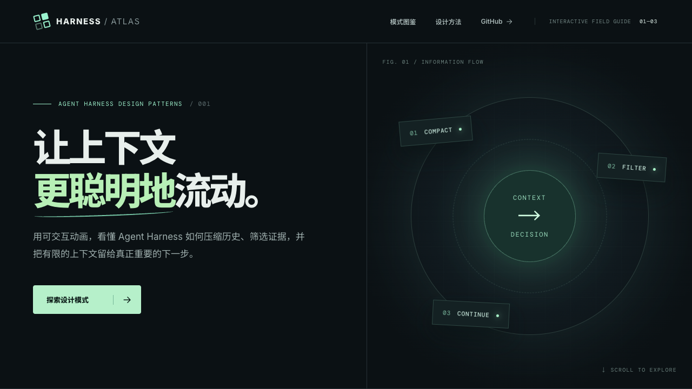

# Harness Atlas

用统一的交互动画解释 Agent Harness 的上下文管理设计模式。首版覆盖：



1. **Codex 上下文交接**：新窗口硬切与摘要桥接两种不同路径。
2. **Jev 工具历史筛选**：对成对的 tool call / result 做保留、截短、移除决策。
3. **Jev 网页证据过滤**：搜索结果筛选、网页抓取、段落相关性判断与证据入窗。

## 运行

```bash
npm install
npm run dev
```

`npm run build` 会进行 TypeScript 检查并输出静态站点到 `dist/`。

演示支持播放、暂停、单步切换、时间线跳转和键盘左右键；空格键可播放或暂停。动画与数字是**教学示意**，无需 API Key，也不会对 Codex 或 Jev 发起真实请求。页面中的百分比表示示意场景里的相对上下文占用，不能当作性能基准。

## 概念边界

- “硬切”演示的是 Codex 模型配置中可选的实验性新窗口路径：先保存进度 notes，下一窗口依靠 notes / history 恢复上下文。它并非所有 Codex 会话的默认压缩行为。
- “摘要”演示的是本地文本摘要桥接。OpenAI Responses API 的服务端与独立 `/responses/compact` 还支持 opaque compaction item；页面脚注指出这一差异。
- Jev 是**决策层**。工具执行、网页抓取、分段、阈值策略与低置信度回退由 Harness 负责。Jev 筛选流程是可实现的架构示意，并未声称 Codex 原生集成了 Jev。
- 删除工具历史时要保持 tool call 与 result 配对；不能把模型仍需引用的错误、文件路径或用户约束当成噪声。

## 资料

- [OpenAI API Compaction](https://developers.openai.com/api/docs/guides/compaction)
- [Codex 模型配置](https://github.com/openai/codex/blob/main/codex-rs/models-manager/models.json)
- [Codex 本地压缩实现](https://github.com/openai/codex/blob/main/codex-rs/core/src/compact.rs)
- [Jev API 与决策类型](https://www.jevai.org/docs)
- [fast-jev-compaction](https://github.com/tamaratran/fast-jev-compaction)
- [psearch：Jev 引导的网页搜索实例](https://github.com/komikat/psearch)
- [Matija Sosic 的 Jev 动画](https://x.com/MatijaSosic/status/2100190746389135772)：叙述节奏的参考，本站视觉与动画重新设计。

## 后续可扩展

每个模式沿用 `输入 → 判断 → 输出 → 影响` 的结构。新增模式时，在 `src/main.ts` 中增加 scene 数据与图解组件，并在 `src/style.css` 中复用相同的颜色语义和时间线状态。若后续加入真实 Jev 调用，应另建服务端代理，避免在前端暴露 API Key，并让评分、阈值、回退策略可审计。

## License

MIT
